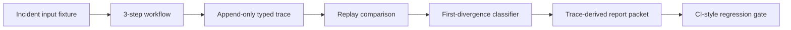

# TraceForge

[](https://github.com/eriksrice/traceforge/actions/workflows/ci.yml)

TraceForge is a file-backed incident replay system for LLM/tool pipelines. It captures typed traces, replays seeded incidents deterministically, detects the first divergent step, and turns the fix into a CI-style regression gate.

## Problem

Production LLM failures are hard to reconstruct after prompts, model outputs, tool responses, and intermediate state have changed. Conventional logs can show that a final answer changed, but they often miss the first causal step.

TraceForge v1 makes one failure replayable: a prompt regression sends a checkout API timeout alert to the wrong diagnostic tool. The bad workflow gathers plausible but irrelevant billing evidence and misclassifies a service regression as a billing issue.

## Why This Matters

The project is built to show production AI reliability work:

- Typed trace instrumentation for LLM/tool workflows.
- Deterministic replay with cached model outputs and mocked tool responses.
- Framework-neutral contracts rather than a LangGraph dependency.
- First-divergence detection instead of shallow final-output diffs.
- Incident reconstruction from append-only artifacts.
- Release gating for prompt, model, and tool behavior changes.

Resume-ready summary:

- Built a deterministic replay harness for LLM/tool pipeline incidents using typed trace events, mocked tool contracts, and protected-field comparison.
- Implemented first-divergence classification that separates root tool-selection failures from downstream evidence and state changes.
- Converted a seeded incident and patched fix into a CI-backed regression gate with reproducible trace and report artifacts.

## V1 Scope

- One 3-step incident triage workflow.
- One typed trace event schema.
- One file-backed append-only trace store.
- One mocked tool replay layer.
- One seeded wrong-tool-selection incident.
- One deterministic replay comparator.
- One bounded report packet: first-divergence report, incident timeline report, and regression gate report.
- One CI-style regression gate.

No dashboard, LangGraph integration, live provider calls, vector database, external service, or broad agent platform is included in v1.

## Architecture



```text
fixtures/          cached model outputs, mocked tool responses, incident input
src/traceforge/    typed models, hashing, fixture loading, workflow, replay, reports, gate
traces/            generated JSONL traces and comparison JSON
reports/           generated markdown reports
tests/             focused contract, fixture, workflow, replay, report, and gate tests
scripts/demo.sh    reproducible reviewer demo
```

Core modules:

- `models.py`: Pydantic contracts for trace events, replay comparisons, divergence labels, and gate results.
- `fixtures.py`: deterministic fixture loading and contract validation.
- `workflow.py`: fixture-backed 3-step incident workflow.
- `tracing.py`: append-only JSONL trace writing and reading.
- `diff.py`: protected-field comparison and first-divergence detection.
- `replay.py`: trace-file comparison artifact generation.
- `reports.py`: trace-derived markdown reports.
- `gate.py`: CI-style seeded regression gate.
- `cli.py`: Typer command entry points.

Typer is used because the CLI has typed options and small subcommands without needing a larger framework.

## Demo

Reviewer fast path:

```bash
git clone https://github.com/eriksrice/traceforge.git
cd traceforge
python -m pip install -e ".[dev]"
./scripts/demo.sh
```

Install dependencies:

```bash
python -m pip install -e ".[dev]"
```

Run the full reproducible path:

```bash
./scripts/demo.sh
```

Equivalent manual commands:

```bash
PYTHONPATH=src python -m pytest
PYTHONPATH=src python -m traceforge run --case baseline
PYTHONPATH=src python -m traceforge run --case incident
PYTHONPATH=src python -m traceforge run --case patched
PYTHONPATH=src python -m traceforge replay --baseline traces/baseline_good.jsonl --candidate traces/incident_bad.jsonl
PYTHONPATH=src python -m traceforge report first-divergence --comparison traces/replay_baseline_vs_incident.json
PYTHONPATH=src python -m traceforge report timeline --trace traces/incident_bad.jsonl --comparison traces/replay_baseline_vs_incident.json
PYTHONPATH=src python -m traceforge gate
```

Expected result:

- Bad run first divergence: `step_1.output.requested_tool`
- Baseline value: `service_metrics_lookup`
- Incident value: `billing_ledger_lookup`
- Root label: `tool_selection_changed`
- Patched comparison: `matched`
- Gate status: `pass`

## Generated Artifacts

Trace artifacts:

- `traces/baseline_good.jsonl`
- `traces/incident_bad.jsonl`
- `traces/patched_good.jsonl`
- `traces/replay_baseline_vs_incident.json`
- `traces/replay_baseline_vs_patched.json`
- `traces/regression_gate_result.json`

Report artifacts:

- `reports/first_divergence_report.md`
- `reports/incident_timeline.md`
- `reports/regression_gate_report.md`

These are produced by code and can be regenerated with `python -m traceforge gate`. The first-divergence and timeline reports can also be regenerated directly with `python -m traceforge report ...`.

For a reviewer narrative, see [docs/case_study.md](docs/case_study.md). For the AI Analytics Engineer angle, see [docs/analytics_view.md](docs/analytics_view.md).

## Evaluation Strategy

The seeded regression gate passes only when:

- Baseline, incident, and patched traces validate.
- The bad run reproduces the wrong tool route.
- The first blocking divergence is Step 1 `requested_tool`.
- Downstream tool/evidence/classification changes are linked to that root divergence.
- The patched run matches baseline protected fields.
- Regression replay uses cached model fixtures and mocked tool fixtures only.
- Reports are generated from trace and comparison artifacts.

## Current Status

Phase 8 complete. The project has the reproducible v1 path, generated artifacts, tests, report commands, gate command, demo script, CI workflow, and reviewer case study.

## Limitations

- V1 uses synthetic/cached model outputs.
- Tool responses are mocked fixtures.
- The corpus contains one seeded incident.
- No live provider replay is included.
- No dashboard or tracing backend is included.

## Future Work

- Add a LangGraph adapter after the custom replay loop remains stable.
- Add optional live-provider exploratory mode outside the regression gate.
- Add multiple workflow topologies and incident types.
- Add richer determinism statistics.
