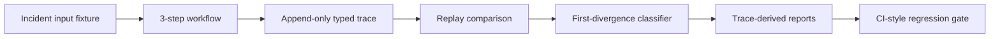

# TraceForge Case Study

## Problem

Production LLM/tool pipelines can fail in the space between model output, tool selection, tool evidence, and state transition. Conventional logs may show that the final classification changed, but they often do not prove which intermediate decision first caused the incident.

TraceForge v1 reconstructs one seeded failure: a checkout API timeout should route to service metrics, but a prompt regression sends the workflow to billing evidence instead.

## Incident

- Input: checkout API timeout alert.
- Expected route: `service_metrics_lookup`.
- Bad route: `billing_ledger_lookup`.
- Failure mode: wrong but plausible evidence causes the workflow to classify a service regression as a billing issue.
- Protected first divergence: `step_1.output.requested_tool`.

## System Shape



## Reproduction

Run the complete path:

```bash
python -m pip install -e ".[dev]"
./scripts/demo.sh
```

Or run the core commands directly:

```bash
python -m pytest
python -m traceforge gate
```

Expected summary:

```text
bad_first_divergence=step_1.output.requested_tool
bad_expected=service_metrics_lookup
bad_observed=billing_ledger_lookup
patched_status=matched
gate_status=pass
```

## Evidence Artifacts

TraceForge writes file-backed evidence:

- `traces/baseline_good.jsonl`
- `traces/incident_bad.jsonl`
- `traces/patched_good.jsonl`
- `traces/replay_baseline_vs_incident.json`
- `traces/replay_baseline_vs_patched.json`
- `traces/regression_gate_result.json`
- `reports/first_divergence_report.md`
- `reports/incident_timeline.md`
- `reports/regression_gate_report.md`

These artifacts are generated by code. They are not manually written incident summaries.

## What The Comparator Proves

The comparator checks explicit protected fields rather than treating every trace value as deterministic evidence. It fails the bad run because Step 1 changed the requested tool from `service_metrics_lookup` to `billing_ledger_lookup`.

Downstream differences in evidence family, state transition, incident type, severity, next action, and escalation are classified as effects of the first route divergence.

The patched run passes because protected fields match the baseline again.

## Why This Matters For Production AI

This project demonstrates:

- Trace instrumentation for LLM/tool workflows.
- Deterministic replay using cached model outputs and mocked tool contracts.
- First-divergence analysis instead of final-output diffing.
- Incident reconstruction from append-only events.
- Release gating for prompt, tool, and workflow changes.

## Limitations

- V1 contains one seeded incident.
- Model outputs are cached fixtures.
- Tool responses are mocked fixtures.
- No live provider replay is included.
- No dashboard or tracing backend is included.

These constraints are intentional: the goal is to prove the replay contract before adding nondeterministic or platform-scale features.
